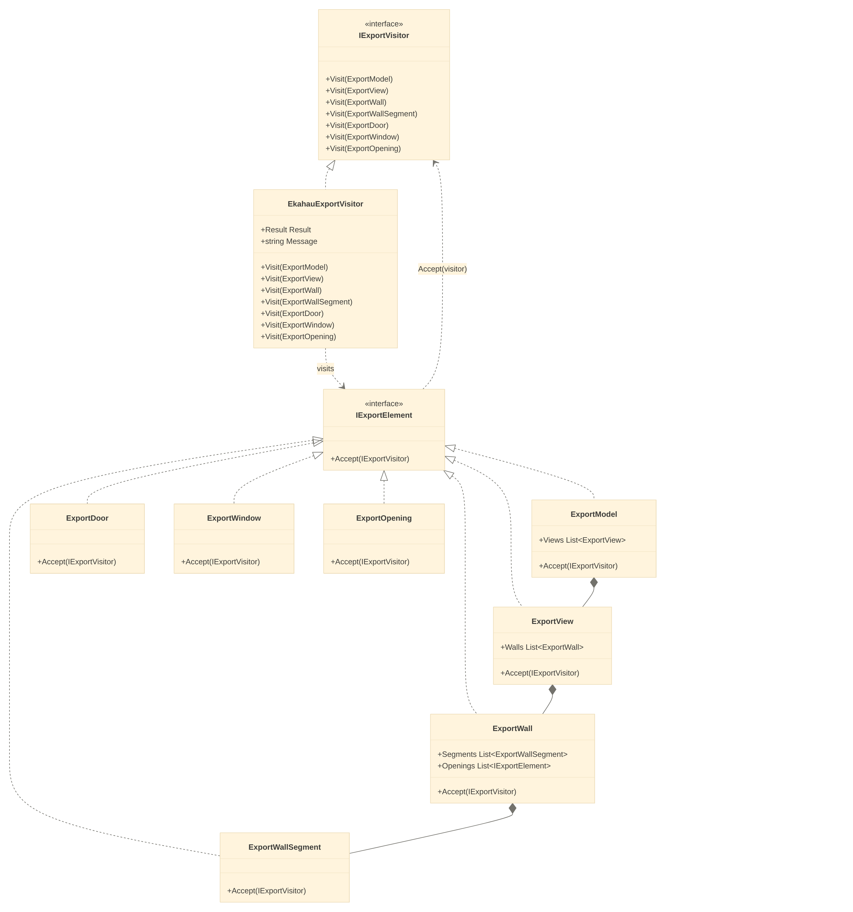
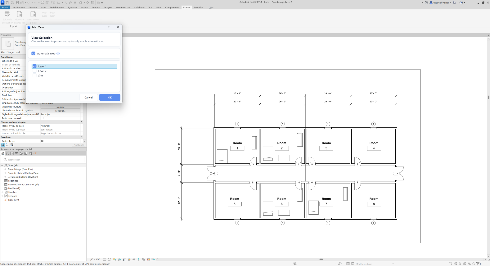
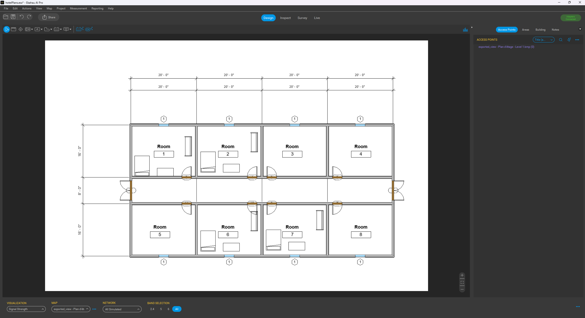
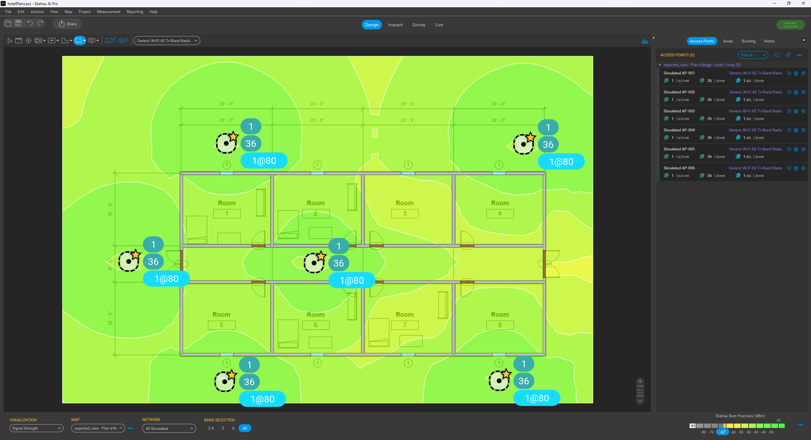
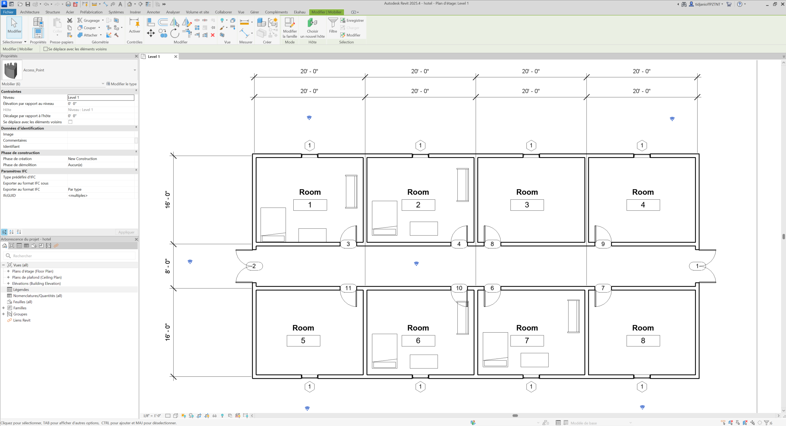
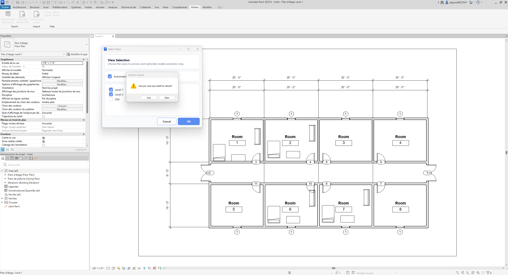

# Réalisation

<!-- > :bulb: Cette page sert à présenter les travaux réalisés incluant la conception.  
> Elle ne remplace pas le rapport final, mais permet de documenter progressivement les travaux réalisés, les décisions prises et les principaux résultats obtenus. -->

## Architecture ou structure générale

Le plugin **Revit-Ekahau** est développé en **C#** à l’aide de l’**API Autodesk Revit** et permet les échanges de données entre les modèles BIM de **Revit** et les projets de planification Wi-Fi utilisés dans **Ekahau AI Pro**.

Deux versions du plugin sont maintenues afin d’assurer la compatibilité avec les différentes versions de Revit utilisées par **BPA** :

- **.NET 4.8** pour Revit 2024 et les versions antérieures compatibles ;
- **.NET 8.0** pour Revit 2025 et les versions postérieures.

Les deux versions proposent les mêmes fonctionnalités principales d’**exportation Revit → Ekahau** et d’**importation Ekahau → Revit**. L’interface utilisateur est développée avec **WPF/XAML**.

### Architecture du module d’exportation

Une refactorisation du module d’exportation a été réalisée afin de mieux séparer l’extraction des données provenant de Revit de leur transformation vers un format externe.

La nouvelle architecture s’appuie notamment sur le patron de conception **Visitor**, permettant de réduire le couplage avec le format Ekahau et de faciliter l’évolution du module.

*Nouvelle architecture du module d’exportation.*

## Fonctionnalités ou composantes réalisées

### Exportation Revit → Ekahau

La fonctionnalité d’exportation permet d’extraire les informations pertinentes d’un modèle Revit afin de générer les données nécessaires à leur utilisation dans **Ekahau AI Pro**.

Au cours du projet, plusieurs corrections ont été apportées à ce module afin d’améliorer sa fiabilité, notamment pour le traitement des murs, des plans et de leur positionnement. La fonctionnalité a également fait l’objet d’une refactorisation afin de réduire son couplage avec le format Ekahau.

*Sélection des vues du projet à exporter sur Autodesk Revit 2025.*

*Résultat de l’exportation dans Ekahau AI Pro, avec conservation du plan et des principaux éléments architecturaux issus du modèle Revit, notamment les murs, portes et fenêtres.*

### Importation Ekahau → Revit

La fonctionnalité d’importation permet de récupérer des données provenant d’un projet Ekahau et de les intégrer dans le modèle Revit.

Elle est notamment utilisée pour réimporter les points d’accès positionnés dans Ekahau afin de les replacer automatiquement dans le modèle BIM correspondant.

*Points d’accès positionnés dans Ekahau AI Pro avant leur importation dans Revit.*

*Résultat de l’importation dans Autodesk Revit 2025, avec création et positionnement automatique des points d’accès dans le modèle BIM.*

### Améliorations UI/UX

Plusieurs ajustements ont été apportés à l’interface du plugin afin de rendre les principaux flux d’utilisation plus clairs et plus cohérents.

Ces améliorations concernent notamment l’organisation des commandes dans Revit, les interfaces d’importation et d’exportation ainsi que les retours fournis à l’utilisateur lors de l’exécution des différentes opérations.

## Difficultés rencontrées

Plusieurs difficultés techniques ont été rencontrées au cours du projet.

- La maintenance de deux versions du plugin, basées respectivement sur **.NET 4.8** et **.NET 8.0**, a nécessité de valider les modifications dans deux environnements distincts.
- Certains comportements problématiques observés avec **Revit 2025** ont été difficiles à isoler. Les premiers tests laissaient penser que les problèmes pouvaient provenir des modèles utilisés, avant que des essais avec d’autres projets permettent de confirmer qu’ils étaient liés au plugin.
- Plusieurs problèmes liés au traitement géométrique ont également dû être corrigés, notamment l’alignement entre les murs exportés et l’image du plan.

## Décisions et ajustements

Plusieurs ajustements ont été apportés à l’approche initiale au cours du projet.

- Les problèmes rencontrés avec la version **Revit 2025 / .NET 8.0** ont conduit à tester le plugin avec plusieurs modèles fournis par **BPA** afin de mieux isoler leur origine.
- Une refactorisation du module d’exportation a été entreprise afin de réduire sa dépendance directe envers Ekahau et d’améliorer sa maintenabilité.
- Le patron de conception **Visitor** a été adopté pour mieux séparer l’extraction des données Revit de leur transformation vers des formats externes.
- Le **Single Responsibility Principle (SRP)** a été appliqué à certaines méthodes afin de mieux séparer leurs responsabilités.
- Les deux versions du plugin ont été harmonisées autant que possible au niveau de leur architecture et de leur organisation.
- Des améliorations UI/UX ont été ajoutées progressivement afin de rendre les principaux flux d’utilisation plus clairs pour les utilisateurs.